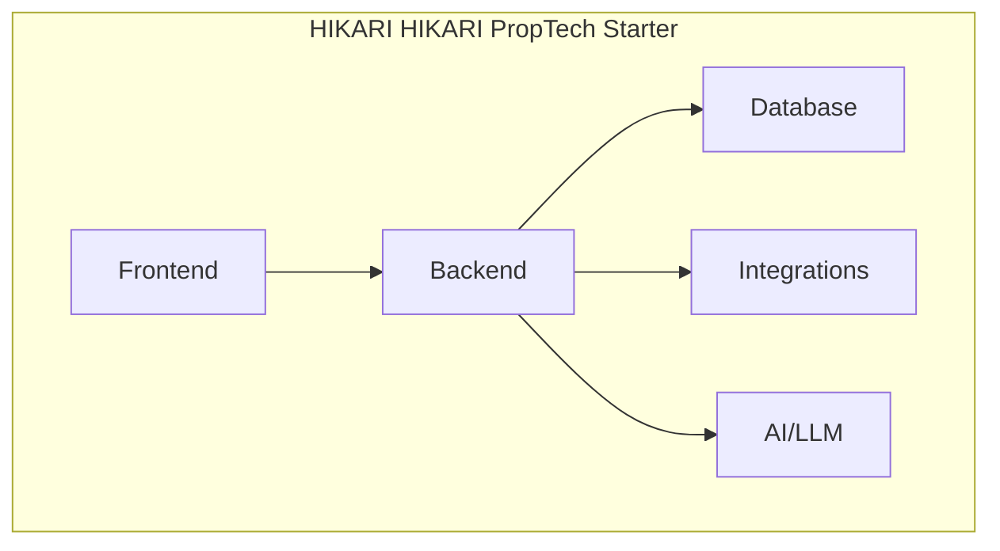

<div align="center">

# 🏔️ HIKARI PropTech Starter

**Template de démarrage SaaS PropTech — React + Tailwind + Base44 + Stripe**

[](./LICENSE) [](https://react.dev/) [](https://vitejs.dev/) [](https://tailwindcss.com/) [](https://base44.com/) [](https://stripe.com/) [](https://www.typescriptlang.org/)
[](./CHANGELOG.md)
[](./CONTRIBUTING.md)
[](https://github.com/HIKARI-GROUP/hikari-proptech-starter)
[](https://github.com/HIKARI-GROUP/hikari-proptech-starter/commits)
[](https://github.com/HIKARI-GROUP/hikari-proptech-starter/discussions)

[📖 Documentation](./docs/) · [🗺️ Roadmap](./ROADMAP.md) · [🤝 Contributing](./CONTRIBUTING.md) · [💻 Examples](./examples/) · [🧪 Tests](./tests/) · [🤖 AI](./ai/) · [💼 Careers](./CAREERS.md)

</div>

---

## 📋 Overview

A production-ready SaaS starter template for PropTech applications. Includes auth, payments, dashboard, SEO, and the HIKARI design system.

## ✨ Features

- 🔐 Authentication (email + Google OAuth + OTP)
- 💳 Stripe subscriptions
- 📊 Dashboard layout
- 🎨 HIKARI design system (dark theme)
- 🔍 SEO optimized (meta tags, sitemap)
- 📱 Responsive (mobile + desktop)
- 🤖 AI-ready (LLM integration patterns)

## 🏗️ Architecture



See [Architecture](./docs/Architecture.md) for full details.

## 🚀 Installation

```bash
npx degit HIKARI-GROUP/hikari-proptech-starter my-proptech
```

## 📖 Usage

```javascript
cd my-proptech
npm install
npm run dev
```

## 📁 Project Structure

```
hikari-proptech-starter/
├── src/
│   ├── pages/          # React pages
│   ├── components/     # UI components
│   ├── lib/            # Utils & hooks
│   ├── api/            # Base44 client
│   └── index.css       # Design tokens
├── base44/
│   ├── entities/       # Database schemas
│   └── functions/      # Backend functions
└── .github/
```

## 🛠️ Technologies

- React 18
- Vite
- Tailwind CSS
- Base44
- Stripe
- TypeScript

## 📚 Documentation

| Document | Description |
|---|---|
| [Architecture](./docs/Architecture.md) | System architecture and design decisions |
| [Backend](./docs/Backend.md) | Backend services and API |
| [Frontend](./docs/Frontend.md) | Frontend architecture |
| [Database](./docs/Database.md) | Database schema and operations |
| [API](./docs/API.md) | API conventions |
| [Authentication](./docs/Authentication.md) | Auth flows |
| [Security](./docs/Security.md) | Security practices |
| [Deployment](./docs/Deployment.md) | Deployment guide |
| [Coding Standards](./docs/Coding-Standards.md) | Code conventions |
| [Testing](./docs/Testing.md) | Testing guide |
| [CI-CD](./docs/CI-CD.md) | CI/CD pipeline |
| [Git Workflow](./docs/Git-Workflow.md) | Branching & PR process |
| [Onboarding](./docs/Developer-Onboarding.md) | Developer onboarding |
| [Environment](./docs/Environment.md) | Environment setup |

## 🗺️ Roadmap

See [ROADMAP.md](./ROADMAP.md) for our full vision.

## 🤝 Contributing

We welcome contributions! Please read [CONTRIBUTING.md](./CONTRIBUTING.md) first.

- 🐛 [Report a bug](https://github.com/HIKARI-GROUP/hikari-proptech-starter/issues/new?labels=bug)
- 💡 [Request a feature](https://github.com/HIKARI-GROUP/hikari-proptech-starter/issues/new?labels=enhancement)
- 📝 [Improve docs](https://github.com/HIKARI-GROUP/hikari-proptech-starter/issues/new?labels=documentation)
- 🔍 [Good first issues](https://github.com/HIKARI-GROUP/hikari-proptech-starter/labels/good%20first%20issue)

## 📄 License

MIT © HIKARI GROUP

## 💼 Careers

We're hiring! See [CAREERS.md](./CAREERS.md) for open positions.

## 🌐 Links

- 🏢 [HIKARI GROUP](https://github.com/HIKARI-GROUP)
- 🌍 [Website](https://hikari-group.tech)
- 💼 [LinkedIn](https://www.linkedin.com/company/hikari-group)
- 📧 [Contact](mailto:contact@hikari-group.tech)

---

<div align="center">
  <sub>Built with ❤️ by <a href="https://github.com/HIKARI-GROUP">HIKARI GROUP</a></sub>
</div>
