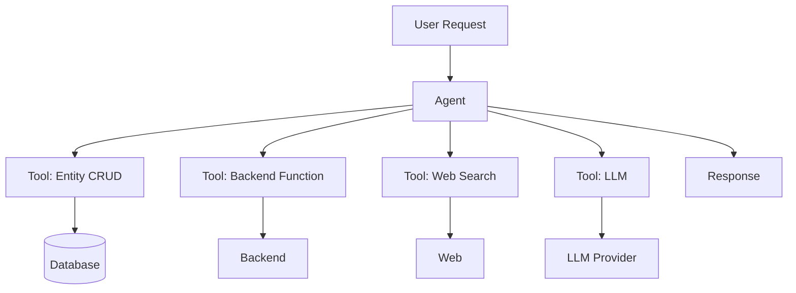

# AI Agent Architecture

> HIKARI uses AI agents for complex, multi-step workflows.

## Architecture



## Agent vs Function

| Aspect | Function | Agent |
|---|---|---|
| Complexity | Single task | Multi-step workflow |
| Tools | None | Entity CRUD, functions, search |
| State | Stateless | Conversation history |
| Use case | API call | Interactive assistant |

## Configuration

Agents are configured in `base44/agents/*.jsonc`:

```json
{
  "description": "Manages tasks in the app",
  "instructions": "Given a user request, edit and manage tasks",
  "tool_configs": [
    { "entity_name": "Task", "allowed_operations": ["create", "read", "update", "delete"] },
    { "function_name": "sendReminder", "description": "Send task reminder" }
  ]
}
```

## Best Practices

- Give agents clear, specific instructions
- Limit tools to what's needed (principle of least privilege)
- Always require human validation for sensitive actions
- Log agent interactions for debugging
