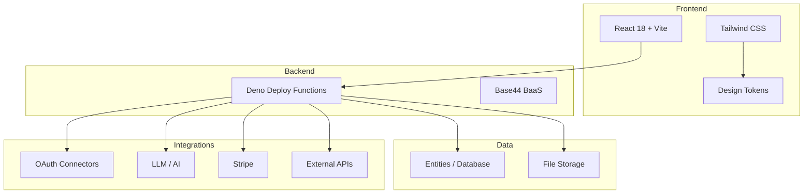

# Architecture

> Part of the [HIKARI GROUP](https://github.com/HIKARI-GROUP) ecosystem.

## Overview

HIKARI products follow a modular, service-oriented architecture built on modern web technologies.

## Design Principles

1. **Separation of concerns** — Frontend, backend, and data layers are strictly separated
2. **Security by default** — Auth checks on every backend function, RLS on every entity
3. **Type safety** — TypeScript end-to-end, JSON Schema for entities
4. **Scalability** — Stateless functions, horizontal scaling on Deno Deploy
5. **Developer experience** — Hot reload, clear errors, comprehensive docs

## Tech Decisions

| Decision | Choice | Rationale |
|---|---|---|
| Framework | React 18 | Ecosystem, maturity, talent pool |
| Styling | Tailwind CSS | Utility-first, design tokens, dark mode |
| Backend | Deno Deploy | Edge runtime, TypeScript native, fast cold starts |
| BaaS | Base44 | Auth, DB, hosting, integrations in one platform |
| Payments | Stripe | Industry standard, subscriptions, webhooks |
| AI | Multi-model LLM | Flexibility across providers |
