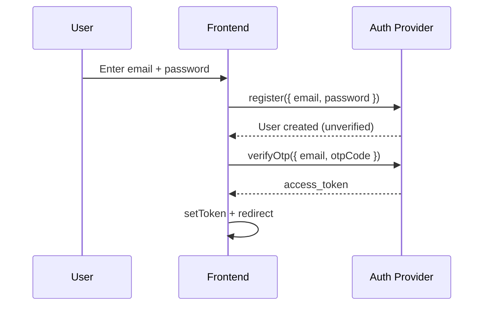

# Authentication

> HIKARI uses Base44's built-in authentication system.

## Auth Flow



## Methods

| Method | Description |
|---|---|
| Email + Password | Registration with OTP verification |
| Google OAuth | One-click sign-in |
| Facebook OAuth | Social login |

## SDK

```javascript
base44.auth.me()                    // Current user
base44.auth.isAuthenticated()      // Promise<boolean>
base44.auth.logout(redirectUrl?)   // Logout + redirect
base44.auth.updateMe(data)         // Update user profile
```

## Route Protection

```jsx
import ProtectedRoute from '@/components/ProtectedRoute';
<Route element={<ProtectedRoute />}>
  <Route path="/admin" element={<Admin />} />
</Route>
```

Hard redirects (`window.location.href`) are required after auth state changes.
