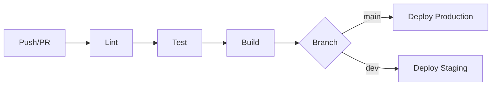

# CI/CD

> HIKARI uses GitHub Actions for continuous integration and delivery.

## Pipeline



## Workflow File

```yaml
name: CI
on: [push, pull_request]
jobs:
  test:
    runs-on: ubuntu-latest
    steps:
      - uses: actions/checkout@v4
      - uses: actions/setup-node@v4
        with: { node-version: 20 }
      - run: npm ci
      - run: npm run lint
      - run: npm test
      - run: npm run build
```

## Checks

1. **Lint** — ESLint + Prettier
2. **Type check** — TypeScript compiler
3. **Unit tests** — Vitest
4. **Build** — Vite production build
5. **E2E** — Playwright (on PR to main)
