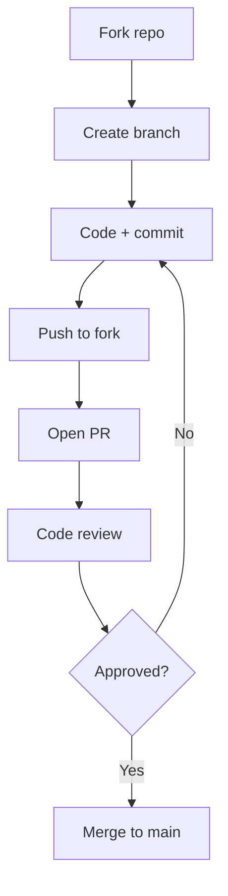

# Git Workflow

> HIKARI uses a simplified GitHub Flow.

## Branching

```
main          ← Production-ready code
feature/*     ← New features
fix/*         ← Bug fixes
hotfix/*     ← Urgent production fixes
docs/*        ← Documentation only
```

## Process



## Commit Convention

```
feat: add ROI calculator component
fix: resolve auth redirect loop
docs: add API documentation
refactor: extract DVF fetch logic
test: add yield calculation tests
```

## PR Rules

- Keep PRs small and focused
- Include tests for new features
- Update documentation
- Ensure CI passes
